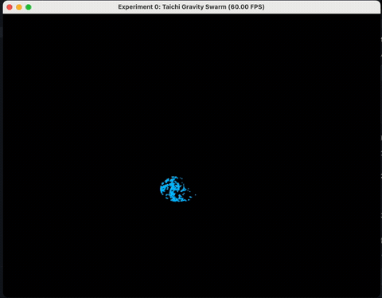

# GG-lab - Taichi 粒子系统实验

## 项目架构

本项目是一个基于 Taichi 的粒子系统实验，主要用于演示 GPU 加速的粒子物理模拟。

### 目录结构

```
GG-lab/
├── src/
│   └── Work0/
│       ├── __init__.py
│       ├── config.py      # 配置参数
│       ├── physics.py     # 物理模拟代码
│       └── main.py        # 主程序
├── .gitignore
├── main.py               # 根目录测试文件
├── pyproject.toml        # 项目配置
└── README.md             # 项目文档
```

## 代码逻辑

### 1. 配置模块 (config.py)
- 定义物理系统参数：粒子数量、引力强度、空气阻力系数等
- 定义渲染系统参数：窗口分辨率、粒子半径、颜色等

### 2. 物理模块 (physics.py)
- 使用 Taichi 定义粒子的位置和速度字段
- 实现粒子初始化函数，随机生成粒子位置
- 实现物理更新函数，包括：
  - 计算鼠标对粒子的引力
  - 应用空气阻力
  - 处理粒子与边界的碰撞

### 3. 主程序 (main.py)
- 初始化 Taichi 环境
- 编译 GPU 内核
- 创建 GUI 窗口
- 进入渲染主循环：
  - 获取鼠标位置
  - 调用物理更新函数
  - 绘制粒子
  - 显示窗口

## 实现功能

- **GPU 加速**：使用 Taichi 框架利用 GPU 并行计算，高效处理大量粒子
- **鼠标交互**：鼠标位置会对粒子产生引力，粒子会跟随鼠标移动
- **物理模拟**：实现了基本的物理效果，包括引力、阻力和碰撞
- **实时渲染**：实时绘制粒子的运动状态

## 运行效果

### 粒子群交互效果

粒子会受到鼠标的引力影响，形成围绕鼠标的流动效果。当鼠标移动时，粒子群会跟随鼠标并形成有趣的流动图案。



*演示：鼠标移动时粒子跟随效果*

## 运行方法

1. 安装依赖：
   ```bash
   uv install
   ```

2. 运行程序：
   ```bash
   uv run -m src.Work0.main
   ```

## 技术栈

- Python 3.12+
- Taichi 1.7.4+
- NumPy

## 注意事项

- 如果运行时出现卡顿，可以在 `config.py` 中减小 `NUM_PARTICLES` 的值
- 确保你的设备支持 GPU 加速，否则 Taichi 会自动回退到 CPU 模式
